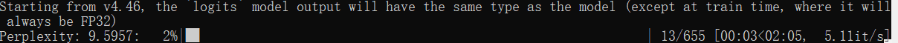
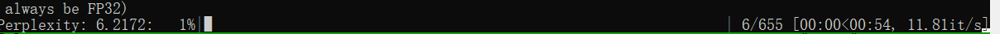

# MixQ


MixQ: Taming Dynamic Outliers in Mixed-Precision Quantization by Online Prediction

We use  mixed-precision GEMM for enhancing throughput.

Please refer to https://github.com/Qcompiler/vllm-mixed-precision for end-to-end text generation.

## Comparision with AWQ

Assuming we have a task that is to compute the PPL(perplexity) of Wikitext2. 
The dataset wikitext contains 333088 validation data.

For ```batch size  = 32```, the task is devided into 10409 parts.

AWQ finished the task in 10 minutes with  16.71 it/s.


MixQ (W8A8O16)   finished the task in 4.50 minutes with 35.02 it/s.


For ```batch size  = 512```, the task is devided into 655 parts.

AWQ finished the task in 127 seconds with  5.2 it/s.



MixQ (W8A8O16) finished the task in 30 seconds with 21.34 it/s.




## Setup

Please download the mixlib kernel from https://github.com/Qcompiler/QComplier:

```
git clone git@github.com:Qcompiler/QComplier.git
cd EETQ 
python setup.py install
```
```
cd quantkernel
python setup.py install 
```

## Benchmarking the throughput


It is very easy to quantize a LLM and run by MIXQ 4bit or 8bit kernel

Running the following CMD to quantize the LLM with W8A8O16 kernel: 

```
python examples/basic_quant_mix.py --model_path /mnt/data/checkpoint/Llama-2-7b --quant_file /home/dataset/quant/quant8/Llama-2-7b --w_bit 8
```

Benchmark the throughput of MIXQ by:

```
python benchflops.py --model_type mix --model_path /home/dataset/quant/quant8/Llama-2-7b --quant_file /home/dataset/quant/quant8/Llama-2-7b --batch_size 512 --bit 8 
```

In  NVIDIA A100-PCIE-40GB, the output is

```
Version: mix 8bit 
|   Batch Size |   Decode Length |   Decode tokens/s | Memory (VRAM)    |
|-------------:|----------------:|------------------:|:-----------------|
|          512 |            1024 |           10609.8 | 7.86 GB (19.97%) |
```


# News !!

We have integrate the MixedQLinear  designed by QUIK into our framework! The QUIK now is able to support a wide range of LLMs including:


- Llama-2 7B/13B/70B
- Llama-3 8B
- Falcon 7B/40B
- ChatGLM 7B
- QWen2 7B


## How to Run

It is very easy to quantize a LLM and run by QUIK 4bit kernel

Running the following CMD to quantize the LLM 

```
python examples/basic_quant_quik.py --model_path /mnt/data/checkpoint/Llama-2-7b --quant_file /home/dataset/quant/quantquik4/Llama-2-7b --w_bit 4
```

Benchmark the throughput of QUIK by:

```
python  benchflops.py  --model_type quik --model_path   /home/dataset/quant/quantquik4/Llama-2-7b \
             --quant_file /home/dataset/quant/quantquik4/quik4/Llama-2-7b \
             --batch_size 512 --bit 4
```

In  NVIDIA A100-PCIE-40GB, the output is

```
Version: quik 4bit
|   Batch Size |   Decode Length |   Decode tokens/s | Memory (VRAM)    |
|-------------:|----------------:|------------------:|:-----------------|
|          512 |            1024 |           8981.17 | 4.88 GB (12.40%) |
```


# Tensorrt-LLM implementation of QUIK and MIXQ

We have supported the end-to-end text generation in TRT-LLM and VLLM!

For TRT-LLM, please download the NVIDIA TensorRT docker. [TensorRT docker](https://github.com/NVIDIA/TensorRT-LLM). DO NOT USE your local environment!

Please enter the e2eTRTLLM folder https://github.com/Qcompiler/MixQ_Tensorrt_LLM

```
git clone https://github.com/Qcompiler/MixQ_Tensorrt_LLM.git
docker pull registry.cn-hangzhou.aliyuncs.com/dongdongchen/dongdong:v1
```


Please Running the docker:

```
export name=myname
bash -c " nvidia-smi; docker run --rm -it --ipc=host -p 6789:22 \
-v /home/${name}/lianxiang/lianxiangTRT/:/code/tensorrt_llm   \
-v  /mnt/octave/data/${name}/checkpoint:/dataset    \
-v /home/${name}/checkpoint:/code/checkpoint \
-v /mnt/octave/data/${name}/lianxiang/checkpoint:/octave/checkpoint \
               --ulimit memlock=-1 --ulimit    stack=67108864             \
                           --gpus=all       \
                       --env 'CCACHE_DIR=/code/tensorrt_llm/cpp/.ccache'            \
                            --env 'CCACHE_BASEDIR=/code/tensorrt_llm'              \
                                                    --workdir /app/tensorrt_llm     \
                                                            --hostname hpc-release \
                  --name tensorrt_llm-release-zhanghy                             \
                                                           --tmpfs /tmp:exec      \
              registry.cn-hangzhou.aliyuncs.com/dongdongchen/dongdong:v1     "
 
```


After starting the docker, set the env :

```
model=Llama-2-7b
ngpu=1
export model_dir=/code/tensorrt_llm/checkpoint/${model}
export quant_dir=/code/tensorrt_llm/checkpoint/checkpoinmix/tllm_checkpoint_${ngpu}gpu_fp16${model}
export out_dir=/code/tensorrt_llm/checkpoint/trt_enginesmix/tllm_checkpoint_${ngpu}gpu_fp16${model}
```

Please quantize the model by:

```
CUDA_VISIBLE_DEVICES=0    python  quantize.py --model_dir  ${model_dir} \
--output_dir  ${quant_dir}  --dtype float16 --device  cpu \
                               --qformat int8_mix  --calib_size 32 
```

Please build the MIXQ model by:

```
CUDA_VISIBLE_DEVICES=0 trtllm-build --checkpoint_dir ${quant_dir} \
   --output_dir ${out_dir} \
        --gemm_plugin float16 --mix_precision int8 
```


Generating the text with MIXQ by:

```
CUDA_VISIBLE_DEVICES=0  python  summarize.py --test_trt_llm \
                    --hf_model_dir ${model_dir} \
                    --data_type fp16 \
                    --engine_dir ${out_dir}
```


## Building the TRT-LLM  MIXQ plugging  with 4 stage pipline  for Llama-2-70B


```
model=Llama-2-70b
ngpu=4
export model_dir=/code/tensorrt_llm/checkpoint/${model}
export quant_dir=/code/tensorrt_llm/checkpoint/checkpoinmix/tllm_checkpoint_${ngpu}gpu_fp16${model}
export out_dir=/code/tensorrt_llm/checkpoint/trt_enginesmix/tllm_checkpoint_${ngpu}gpu_fp16${model}
```

Please quantize the model by:

```
 CUDA_VISIBLE_DEVICES=0,1,2,3   python  quantize.py --model_dir  ${model_dir} \
     --output_dir  ${quant_dir}  --dtype float16 --device  cpu \
    --qformat int8_mix  --calib_size 32 --pp_size ${gpu}
```

Please build the MIXQ model by:

```
CUDA_VISIBLE_DEVICES=0,1,2,3 trtllm-build --checkpoint_dir ${quant_dir} \
       --output_dir ${out_dir} \
           --gemm_plugin float16 --mix_precision int8 
```


Generating the text with MIXQ by:

```
CUDA_VISIBLE_DEVICES=0,1,2,3   mpirun -np 4 --allow-run-as-root    python  summarize.py --test_trt_llm \
                       --hf_model_dir ${model_dir} \
                       --data_type fp16 \
                       --engine_dir ${out_dir}
```


## Text generation result

# Llama-2-7B FP16 baseline


When running the ```summarize.py``` of MIXQ (Llama-2-7B in A100, 40GB, PCIE), we get:


## Mixed-precision Inference In VLLM

Please follow the https://github.com/Qcompiler/vllm-mixed-precision for mixed-precision inference.

Please install the vllm by
```
pip install vllm==0.6.2
```


Please install the mixed-precision source code by
```
git clone git@github.com:Qcompiler/vllm-mixed-precision.git
```

And copy the ".so" from the vllm project

```
cp -r $PYTHON_PATH/lib/python3.11/site-packages/vllm/*.so  vllm-mixed-precision/vllm/
```

Delete the vllm==0.6.2
```
pip uninstall vllm
```


## Runing 8-bit mixed-preiciosn infernce in vllm

```
export PYTHONPATH=$( pwd )
python test8bit.py --quant 8
```
