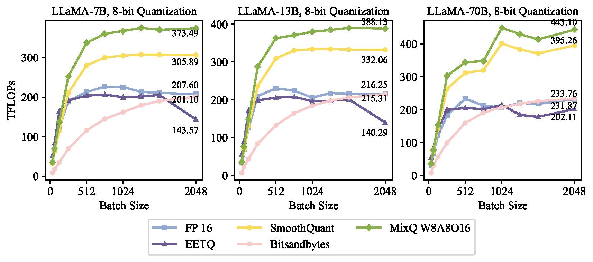

# Benchmarking for kernels

# Benchmarking for MIXQ  in A100

For the 8-bit kernel evaluation in A100:

 

For the 4-bit kernel evaluation in A100:

# Benchmarking for FP8 and INT8 in H100

 In Hopper arch （H100), we bench the kernel performance of FP8, INT8, FP16. We found that the FP8 kernel is slightly slower than INT8 kernel: y-axis is the TFLOPs of kernel, x-axis is the shape of GEMM. M=N=K;

 